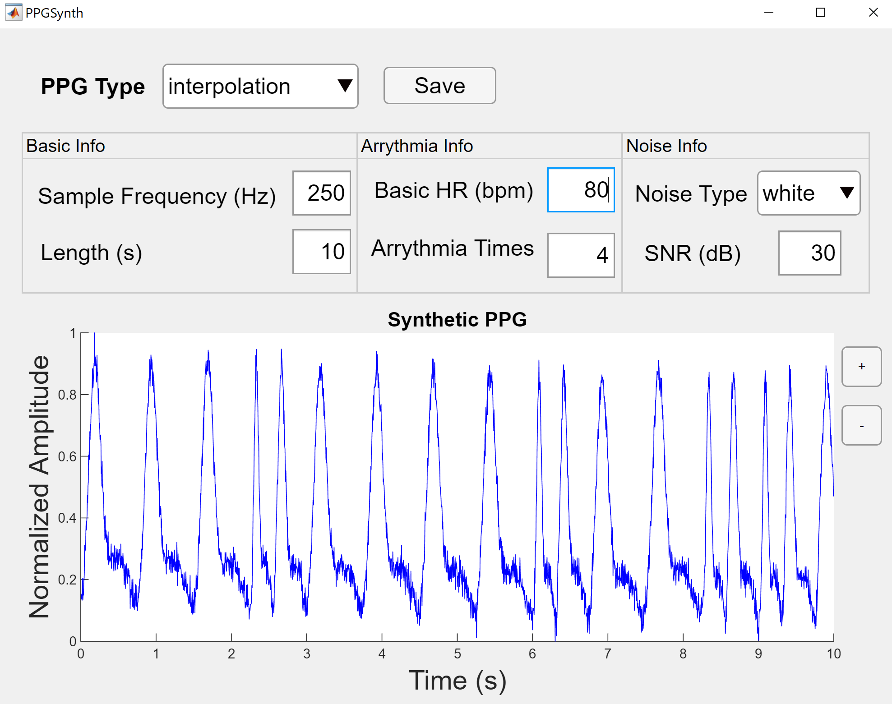

# PPGSynth Executable

## 1. Prerequisites for Deployment
===============================

To ensure proper functionality, verify that version 9.8 (R2020a) of the MATLAB Runtime is installed. 

If the MATLAB Runtime is not installed, follow these steps:

1. Run the MATLAB Runtime installer:
   - Open MATLAB and enter the following command:
     ```matlab
     >> mcrinstaller
     ```
   - **Note:** Administrator rights are required to run the MATLAB Runtime installer.

2. Alternatively, you can download and install the MATLAB Runtime for R2020a directly from the MathWorks website:
   - [Download MATLAB Runtime](https://www.mathworks.com/products/compiler/mcr/index.html)

For more detailed information about the MATLAB Runtime and the installer, refer to the "Distribute Applications" section in the MATLAB Compiler documentation available in the MathWorks Documentation Center.

## 2. Files to Package for Standalone
==================================

- **PPGSynth.exe**: The main executable file.
- **MCRInstaller.exe**: MATLAB Runtime installer.
  - **Note:** If end users are unable to download the MATLAB Runtime using the instructions provided, include this file when building your component by selecting the "Runtime included in package" option in the Deployment Tool.
- **This README file**: Documentation for deployment and usage.

## 3. Definitions
================

For information on deployment terminology, visit the MathWorks Documentation Center and navigate to:
- MATLAB Compiler > Getting Started > About Application Deployment > Deployment Product Terms.

[Visit the MathWorks Documentation Center](https://www.mathworks.com/help)

## 4. Dynamic Modeling of PPG Signals
===================================

This section reflects our perspective on the development of modeling PPG signals. I would like to highlight that PPG is often referred to by different acronyms, which can make it easy to overlook relevant articles using alternative terminology. Additionally, the similarities in waveform morphology across various biomedical signals, such as blood pressure and PPG, can sometimes lead to models being overlooked if they are applied to a different physiological parameter. That said, I have shared below the previous works that have influenced our approach to PPG modeling. If there are any other models that were published but inadvertently missed, please feel free to inform me, and I will promptly update the references.

Previous studies laid the foundational work for this research:

- **Lagerholm et al.** used Hermite functions, closely related to Gaussians, for clustering ECG complexes. Hermite functions not only capture variations in waveform morphology but also provide a mathematical framework that can be adapted for waveform synthesis. By generalizing Gaussian functions, they allow for precise control over signal features, which is essential for generating synthetic signals that mimic real physiological patterns. This approach is thus highly relevant not only for analyzing ECG and PPG signals but also for synthesizing realistic waveforms for testing and modeling purposes [Lagerholm et al., 2000].
- **McSharry et al.** introduced a dynamical model for generating synthetic ECG signals, which laid the groundwork for modeling biological signals like PPG. Their work has influenced subsequent research in synthetic biomedical signal generation [McSharry et al., 2003].
- **Clifford et al.** generated 24-hour ECG, blood pressure, and respiratory signals with realistic linear and nonlinear clinical characteristics using a nonlinear model. This paper is key in generating synthetic biomedical signals [Clifford et al., 2004].
- **Shariati and Zahedi** compared four linear parametric models for analyzing PPG signals, highlighting the strengths and limitations of each approach [Shariati & Zahedi, 2005].
- **Wang et al.** utilized multi-Gaussian functions to fit single PPG waveforms, exploring the effects of different numbers of Gaussian functions on the simulation [Wang et al., 2013].
- **Liu et al.** modeled carotid and radial artery pulse pressure waveforms using Gaussian curve fitting, providing insights into cardiovascular health through waveform analysis [Liu et al., 2013].
- **Martin-Martinez et al.** proposed stochastic modeling to synthesize PPG signals. Their approach involved a single-pulse model based on two Gaussian functions with 10 parameters, using autoregressive moving average models to approximate these parameters [Martin-Martinez et al., 2013].
- **Couceiro et al.** assessed cardiovascular function from multi-Gaussian fitting of a finger photoplethysmogram, demonstrating the application of Gaussian models in analyzing cardiovascular health [Couceiro et al., 2015].
- **Solosenko et al.** developed a model for simulating PPG during atrial fibrillation, using a combination of log-normal and Gaussian waveforms. Their model required an ECG signal as an input parameter to connect individual PPG pulses according to RR intervals [Solosenko et al., 2017].
- **Tang et al.** Their work was inspired by previous efforts to model PPG signals, particularly building upon the foundational work of McSharry et al. and Clifford et al., 2004.

### Our Contribution
Unlike previous models that focus on individual pulses or rely on additional inputs like ECG signals, our dynamic model independently generates synthetic PPGs of varying lengths, sampling frequencies, and different abnormalities. This versatility makes it a valuable tool for a wide range of applications in PPG signal analysis.

### References
1. **Lagerholm, M., et al.** Clustering ECG complexes using Hermite functions and self-organizing maps. *IEEE Transactions on Biomedical Engineering*, 47(7), 838-848 (2000).
2. **McSharry, P. E., Clifford, G. D., Tarassenko, L. & Smith, L. A.** A dynamical model for generating synthetic electrocardiogram signals. *IEEE Trans. Biomed. Eng.* 50, 289–294 (2003).
3. **Clifford, G. D. and McSharry, P. E.** Generating 24-hour ECG, BP and respiratory signals with realistic linear and nonlinear clinical characteristics using a nonlinear model. *Computers in Cardiology*, 709-712 (2004).
4. **Shariati, N. H. & Zahedi, E.** Comparison of selected parametric models for analysis of the photoplethysmographic signal. In *The International Conference on Computers, Communications, and Signal Processing with Special Track on Biomedical Engineering*, 169–172 (2005).
5. **Wang, L., Xu, L., Feng, S., Meng, M. Q. & Wang, K.** Multi-Gaussian fitting for pulse waveform using weighted least squares and multi-criteria decision making method. *Comput. Biol. Med.* 43, 1661–1672 (2013).
6. **Liu, C., et al.** Modeling carotid and radial artery pulse pressure waveforms by curve fitting with Gaussian functions. *Biomed. Signal Process. Control* 8, 449–454 (2013).
7. **Martin-Martinez, D., Casaseca-de-la-Higuera, P., Martin-Fernandez, M. & Alberola-Lopez, C.** Stochastic modeling of the PPG signal: a synthesis-by-analysis approach with applications. *IEEE Trans. Biomed. Eng.* 60, 2432–2441 (2013).
8. **Couceiro, R., et al.** Assessment of cardiovascular function from multi-Gaussian fitting of a finger photoplethysmogram. *Physiological Measurement* 36.9, 1801 (2015).
9. **Solosenko, A., Petrenas, A., Marozas, V. & Sornmo, L.** Modeling of the photoplethysmogram during atrial fibrillation. *Comput. Biol. Med.* 81, 130–138 (2017).
10. **Tang, Q., Chen, Z., Ward, R. et al.** Synthetic photoplethysmogram generation using two Gaussian functions. *Sci Rep* 10, 13883 (2020). [https://doi.org/10.1038/s41598-020-69076-x](https://doi.org/10.1038/s41598-020-69076-x).


